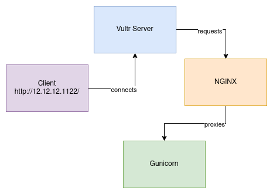

# MIS4180 Final Project

This is my final project for professor Deng's mis course.

The project is a website where users can share the details of their homes, and
the business will turn those details into a hologram. This hologram can be
viewed on any device that supports it. The main goal of this project is to focus
on how we manage and process the data between the user (client) and the system
(server) on the backend.

## Model of data flow:

Basically, the user will navigate to the website via their web browser. They do
this by typing the IPv4 address of the VPS. It is now the responsibility of
`nginx` to call `gunicorn` which hosts the contents of the website. It does this by
reverse proxy. It listens for connections on port `80` (default http:// port)
and passes the requests to `127.0.0.1:8000` (the localhost port 8000 which is
`gunicorn`'s port).

The site would work without the use of a dedicated WSGI, such as `gunicorn`, but
as noted in [Flask's documentation](https://flask.palletsprojects.com/en/3.0.x/deploying/)

> Do not use the development server when deploying to production. It is intended for use only during local development. It is not designed to be particularly secure, stable, or efficient.

## The Tech Stack
- [Python3](https://www.python.org/) Responsible for the actual logic and
  interfacing with SQLite3 and Flask.

- [Flask](https://flask.palletsprojects.com/en/3.0.x/) Lightweight web
  framework for Python

- [Gunicorn](https://gunicorn.org/) WSGI HTTP Server for UNIX (because Flask's
  built-in WSGI is not meant for production).

- [SQLite](https://www.sqlite.org/index.html) SQL Satabase Engine.

- [Vultr](https://www.vultr.com/) Global Cloud Infrastructure (VPS).

- [nginx](https://nginx.org/en/) HTTP and reverse proxy server.

- [Debian Linux](https://www.debian.org/) The Operating System the VPS runs
  (because Windows & MS are disgusting).

## Helpful Resources

Some of the concepts regarding security and controls implemented in the site
abide by the owasp secure login guide:
<https://owasp.org/www-pdf-archive/How_to_Build_a_Secure_Login_BenBroussard_June2011.pd>

